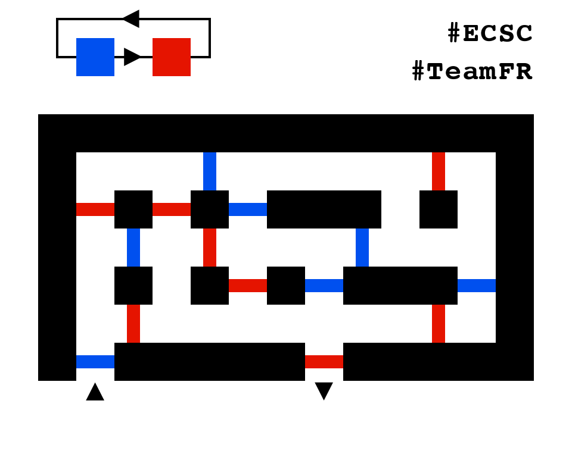

# Mazopotamia

**200 points**

## Enoncé

Bienvenue en Mazopotamia ! Pour obtenir le flag, vous devrez vous échapper de plusieurs labyrinthes comme celui montré ci-dessous :

## Ma solution

### Partie Algorithme (théorie)

On commence par regarder le labyrinthe d'exemple pour élaborer une stratégie.
Ma stratégie est (dans un premier temps) la suivante : On fait un graphe, chaque sommet est une porte. Deux sommets A et B sont reliés (unidirectionnellement, de A vers B) si et seulement si en sortant de A on peut aller à B. On effectue l'algorithme de Dijkstra sur ce graphe pour obtenir le chemin.

J'ai ensuite précisé cette stratégie au fur et à mesure que je rencontrais des problèmes.

- **Problème** : Avec ma stratégie actuelle, je ne prend pas en compte le fait qu'en entrant d'un côté d'une porte, je dois sortir par l'autre.
	**Solution** : on sépare chaque porte en 4 sommets :
	- **entrée 1 vers l'intérieur** (quand on arrive à la porte par l'entrée 1) (relié unidirectionnellement à entrée 2 vers l'extérieur)
	- **entrée 1 vers l'extérieur** (quand on repart de la porte par l'entrée 1) (relié unidirectionnellement  à ce qui est atteignable en partant de l'entrée 1 de la porte)
	- **entrée 2 vers l'intérieur** (quand on arrive à la porte par l'entrée 2) (relié unidirectionnellement à entrée 1 vers l'extérieur)
	- **entrée 2 vers l'extérieur** (quand on repart de la porte par l'entrée 2) (relié unidirectionnellement  à ce qui est atteignable en partant de l'entrée 2 de la porte)

- **Problème** : Comment je sais si je peux aller à la porte B entrée 1 en venant de A entrée 2 (par exemple) ?
  **Solution** : On regarde déjà si la couleur de B suit la couleur de A dans le cycle des couleurs. Si c'est bon, on va effectuer Dijkstra sur un graphe où chaque case libre est un sommet (en sachant que toute autre porte que B est comptée comme un mur)
Si l'entrée de la porte est atteignable, alors on obtient un chemin reliant la porte A entrée 2 à la porte B entrée 1 (qu'on garde précieusement en mémoire). Sinon, on sait qu'on ne doit pas relier ces deux portes.

L'algorithme semble fin prêt : On utilise plein de fois ( O(n²) où n = nombre de portes) le djikstra "micro" pour déterminer les liens entre les portes (qui est atteignable depuis qui ? par quel chemin ?), puis le djikstra "macro" pour déterminer par quelles portes on doit passer.
On recolle ensuite les morceaux : le djikstra "macro" nous dit qu'on doit emprunter le chemin : A1 -> B2 -> C2 -> D1 (par exemple), et les djikstra micro nous on dit que pour faire A1 -> B2 il faut faire NWWSE (par exemple).
La complexité me semble correcte bien qu'un peu lourde ( O(n² * l² * log(l)) où n = nb de portes, l = longueur d'un côté du labyrinthe), mais on verra bien.
On a toutes les pièces du puzzle, et la partie théorique est finie !

### Partie Implémentation

J'aime le Python orienté objet. Je suis donc parti là dessus.
Le `__init__` de la classe Maze transforme la longue chaîne base64 en image, puis lit l'ordre des couleurs et parse le labyrinthe dans un tableau à 2 dimensions.
Il détecte ensuite le départ et l'arrivée, et effectue tous les djikstra "micro" (cf partie algorithme).
La fonction solve effectue le dijkstra "macro", et donne donc le résultat final.
Génial, on a une classe qui permet de résoudre les problèmes posés en 2 lignes !
Pour la fonction djikstra, j'ai repris l'implémentation trouvée [ici](http://isn.irem.univ-mrs.fr/2011-2012/media/resources/dijkstra.py).
Maintenant, il ne reste plus qu'à gérer la partie réseau.
Un gros big up à la classe Netcat trouvable [ici](https://gist.github.com/leonjza/f35a7252babdf77c8421) qui permet de simplifier grandement l'écriture des communications réseau.

## Conclusion
On a assemblé toutes les pièces, on règle la partie réseau et on fait tourner ! Je suis agréablement surpris par la rapidité de mon algorithme (qui ne me semble pas être optimal bien que correct), et je découvre qu'il y a 31 labyrinthes proposés.
Et **le flag nous est donné** à la fin du 31ème labyrinthe :)
